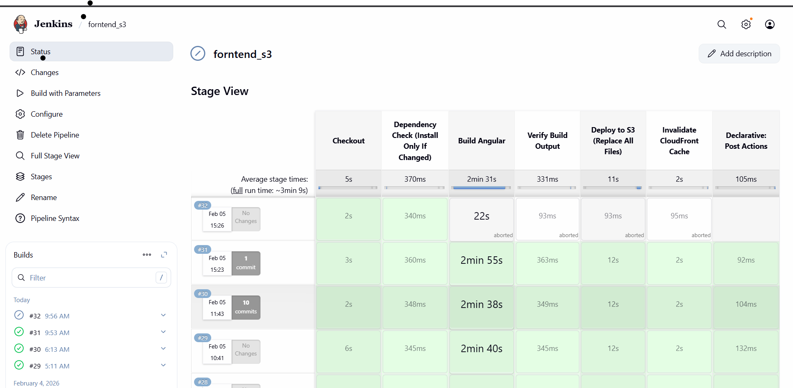
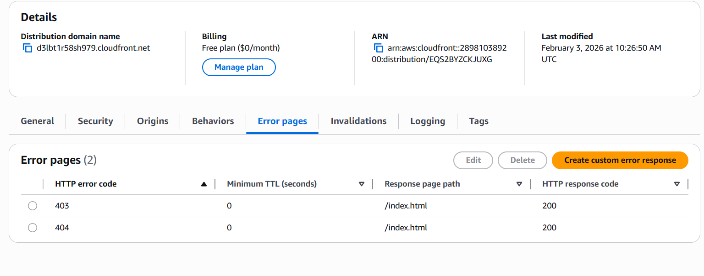

## Production-Ready Angular CI/CD using Jenkins, AWS S3 & CloudFront.
 Star this repo if it saved you hours of AWS + Jenkins debugging.

This repository provides a **production-grade CI/CD pipeline** to deploy an **Angular SPA** using **Jenkins, AWS S3, and CloudFront**.

## Who is this for?
- Frontend developers deploying Angular apps
- DevOps engineers setting up CI/CD
- AWS beginners struggling with SPA routing
- Anyone facing **blank page on refresh** issues

## 🏗 Architecture Overview

Developer → GitHub → Jenkins
                    ↓
               Angular Build
                    ↓
                 S3 Bucket
                    ↓
               CloudFront CDN
                    ↓
                  Browser

## This project provides a production-grade Jenkins pipeline to:
1. Build an Angular application
2. Deploy it to AWS S3
3. Serve it via CloudFront CDN
4. Handle SPA routing + error pages
5. Invalidate cache automatically

## Prerequisites
Jenkins installed
Java 17+
Node.js 16 or 18
npm
AWS CLI

** IAM Setup(Create IAM User)
1.AWS Console → IAM → Users
2.Create user with Programmatic access
3.Attach policy 
4. Attach this policy to the Jenkins ec2 

** S3 Bucket Setup
1. Create Bucket
1.a Name: your-frontend-bucket-name
1.b Region: same as CloudFront origin

3. Disable Public Access
2.a Block ALL public access
2.b CloudFront will access it via OAC

** CloudFront Setup (SPA SAFE)
1. Create Distribution
1.a Origin: S3 bucket
1.b Origin Access Control (OAC): Enabled
1.c Viewer protocol: Redirect HTTP → HTTPS

2. Default Root Object
2.a index.html

3. Error Pages (CRITICAL FOR ANGULAR)
3.a Angular uses client-side routing.
3.b Add these Custom Error Responses:
Error Code	        Response Page	         HTTP Code
   403	            /index.html	             200
   404	            /index.html	             200

** Common Issues & Fixes
1. Blank page on refresh
Fix: Add 403 & 404 → index.html in CloudFront

2. AccessDenied on S3
Fix: Check IAM permissions and bucket policy

3. Angular build memory issue
Fix: NODE_OPTIONS="--max_old_space_size=8000"

## Jenkins Pipeline

## CloudFront SPA Error Configuration

